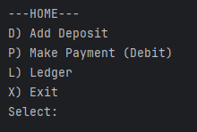
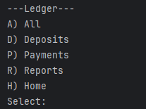
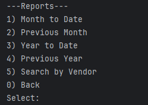
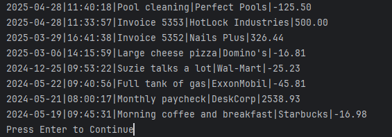

# capstone-1
## Accounting Ledger

This CLI application is a basic editor for a .csv file that stores a transaction ledger.  
For demonstration there is a file called transactions.csv that is formatted like this:  

date|time|description|vendor|amount  

Formats for each section are as follows:  

date: yyyy:MM:dd  
time: HH:mm:ss  
description: description of the transaction  
vendor: who the transaction was made with  
amount: amount for the transaction positive for deposits and negative(-) for payments  

### running the program

After the program starts you will see this screen:  
  

Which prompts the user to type in one of the available options:  
(D) prompt user for the deposit information and save it to the collection  
(P) prompt user for the debit information and save it to the collection  
(L) display the Ledger menu  
(X) Exit the application  

Ledger Menu:  
   


the user once again has some options available:  
(A) Print to console all transactions that are currently in the ledger  
(D) print to console all transactions that are deposits (positive)  
(P) print to console all transactions that are payments (negative)  
(R) take you to the reports menu  
(H) returns to the home screen  

The reports menu:  
  

The reports menu has a few different report types the user can choose to view:  
(1) Month to date  
(2) Previous month  
(3) Year to date  
(4) Previous year  
(5) allows the user to type in a search term and will display transactions that the vendor field contains the search term (if any)  
(0) Returns to the previous screen

Here is an example of what one of the report printouts looks like:  
  

Here is one piece of code in this project I'm proud of:

```java  
public static void reportsMenu() {

    boolean keepReportsRunning = true;
    while(keepReportsRunning) {
        int reportsScreenSelection = getReportsScreenSelection();
        switch (reportsScreenSelection) {
            case 1 -> viewMonthReport(true); //month to date
            case 2 -> viewMonthReport(false); //previous month
            case 3 -> viewYearReport(true); //year to date
            case 4 -> viewYearReport(false); //previous year
            case 5 -> searchByVendor(); //search through records by vendor name
            case 0 -> keepReportsRunning = false; //returns to ledger menu
            default -> System.out.println("Please select a valid option.");
        }
    }
}

private static int getReportsScreenSelection() {
    System.out.println("\n---Reports---\n1) Month to Date\n2) Previous Month\n3) Year to Date\n4) Previous Year\n5) Search by Vendor\n0) Back");
    try {
        return Integer.parseInt(Utils.messageAndResponse("Select: "));
    } catch (NumberFormatException e) {
        System.out.println("\nSomething went wrong! " + e.getMessage());
    }
    return 999;
}
```

These methods create the Reports menu  
The switch statement handles the menu selection and is very clear/readable as to what the menu is doing  
getReportScreenSelection prints out the menu to the console and takes the users input for their selection  
All the menus in my program are built in a similar way. They print out, take the users input and hand it in a simple elegant way that also accounts for unexpected inputs.  
